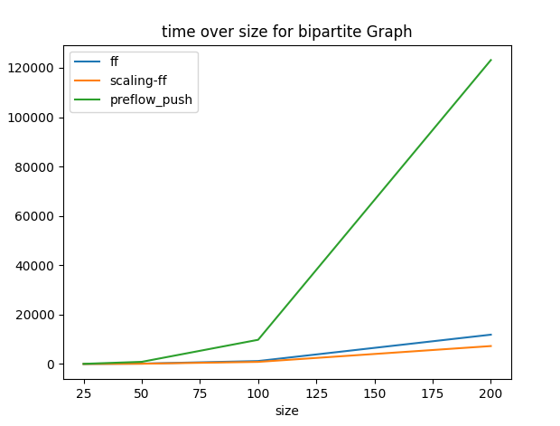
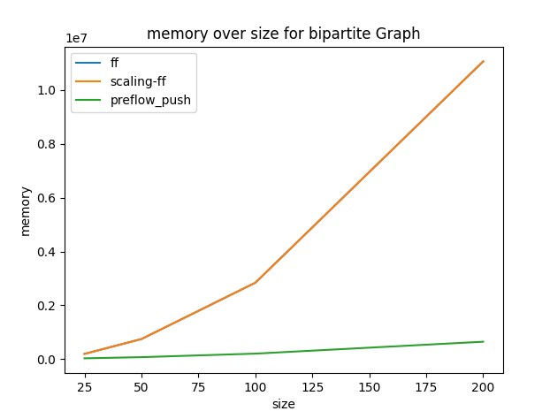
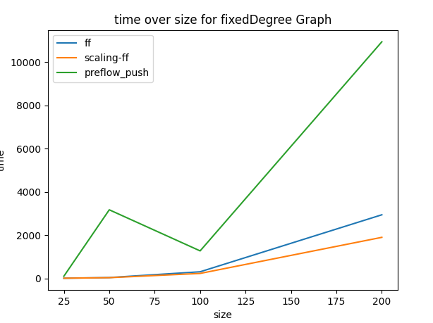
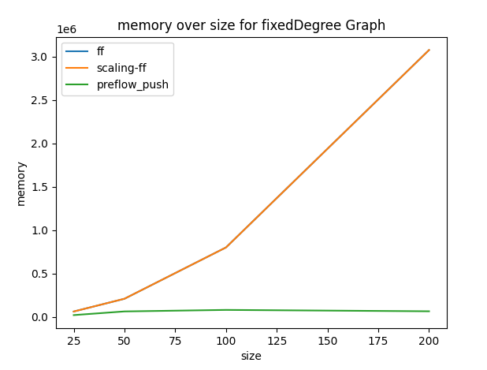

# TCSS 543 Final - Group B

## Requirements

Python 3

Tested with Python 3.12 under Windows, Mac, and Ubuntu on an x86-64 processor. 

To run in benchmark mode, matplotlib is required.

`python3 -m pip install matplotlib`

Matplotlib is unnecessary for running the program in manul mode.

## Usage

### Manual mode

`python3 max_flow.py input_graph_1.txt input_graph_2.txt ...`

Under manual mode, the program will go through each file provided, and list the
max flow found under all three algorithms, along with the time consumed and memory usage.
No plot is provided in this mode.

### Benchmark mode

`python3 max_flow.py` or `python3 max_flow.py --benchmark`: 

Under benchmark mode, the program will run all three max flow algorithms on a fixed set
of bipartite and fixed-degree graphs, at 25, 50, 100, and 200 nodes.

The max flow of each graph will be displayed as calculated by all three algorithms.

Plots of time and memory usage vs graph size for each graph type will be displayed,
with data for all three algorithms displayed together.

## Expected results
### Manual Mode
Under manual mode, the expected output resembles the following (for `test-graphs/random.txt`):
```
.\test-graphs\bipartite\bipartite100.txt
        ff: Max Flow is 24282   Time elapsed is 1122.8530406951904      Memory usage is 2841552
        scaling-ff: Max Flow is 24282   Time elapsed is 853.071928024292        Memory usage is 2841184
        preflow_push: Max Flow is 24282 Time elapsed is 9455.296516418457       Memory usage is 204996
```

The file for the graph being measured is listed first,
followed by lines `ff` for Ford-Fulkerson, `scaling-ff` for Scaling Ford-Fulkerson,
and `preflow_push` for Preflow-Push.
Each row includes the found max flow, time, and memory usage.

Time is in millseconds and memory usage is in bytes.

### Benchmark mode

Under benchmark mode, the expected output is as follows:

```
Max Flow of bipartite25 calculated by ff:  6560
Max Flow of bipartite50 calculated by ff:  13169
Max Flow of bipartite100 calculated by ff:  24282
Max Flow of bipartite200 calculated by ff:  51532
Max Flow of bipartite25 calculated by scaling-ff:  6560
Max Flow of bipartite50 calculated by scaling-ff:  13169
Max Flow of bipartite100 calculated by scaling-ff:  24282
Max Flow of bipartite200 calculated by scaling-ff:  51532
Max Flow of bipartite25 calculated by preflow_push:  6560
Max Flow of bipartite50 calculated by preflow_push:  13169
Max Flow of bipartite100 calculated by preflow_push:  24282
Max Flow of bipartite200 calculated by preflow_push:  51532
Max Flow of fixedDegree25 calculated by ff:  3430
Max Flow of fixedDegree50 calculated by ff:  6164
Max Flow of fixedDegree100 calculated by ff:  12916
Max Flow of fixedDegree200 calculated by ff:  23334
Max Flow of fixedDegree25 calculated by scaling-ff:  3430
Max Flow of fixedDegree50 calculated by scaling-ff:  6164
Max Flow of fixedDegree100 calculated by scaling-ff:  12916
Max Flow of fixedDegree200 calculated by scaling-ff:  23334
Max Flow of fixedDegree25 calculated by preflow_push:  3430
Max Flow of fixedDegree50 calculated by preflow_push:  6164
Max Flow of fixedDegree100 calculated by preflow_push:  12916
Max Flow of fixedDegree200 calculated by preflow_push:  23334
```

The generated plots should resemble the following:






As before, the algorithm names are `ff` for Ford-Fulkerson, `scaling-ff` for Scaling Ford-Fulkerson,
and `preflow_push` for Preflow-Push, time is measured in milliseconds, and space is measured in bytes.

## Dicussion of Algorithm Implementations

For all algorithms, graphs are represented by nested dictionaries.
For each edge `u`->`v` with weight `w` in graph `g`, `g[u][v] = w`.

### Ford-Fulkerson

Ford-Fulkerson operates by repeatedly attempting random paths through the graph,
each time increasing the flow slightly until the maximum is reached.

Ford-Fulkerson is largely implemented in ff.py.

`update_r_graph` builds a residual graph,
`ff` orchestrates the majority of the algorithm.

Additionally, augment.py contains `augment`, which augments a graph with a path through it,
and find_path.py contains `find_path`, which selects a path with positive flow through a graph.

### Scaling Ford-Fulkerson

Scaling Ford-Fulkerson is similar to original Ford-Fulkerson with a difference that with delta scaling phase it uses only the edges with residual capaacity of at least delta, making sure to increase the flow value by at least delta during each augmentation.

* Scaling Ford-Fulkerson is implemented in scaling_ff.py.
    * `max_capacity_out_of_s` - method finding the max capacity of edges going out of s
    * `find_delta` - method finding initial value of delta
    * `update_r_graph` - method updating residual graph with respect to the current capacities and delta
    * `scaling_ff` - contains main logic of the Scaling Ford-Fulkerson algorithm

Other modules used for Scaling Ford-Fulkerson:
* adjacency_list.py - Class to represent an adjacency list of a graph
    * `add_edge` - method to add an edge
    * `delete_edge` - method to delete an edge
    * `reverse` - method to reverse an adjacency list
* augment.py - augments the flow, taking current flow, augmenting path and current capacities as input parameters
* bfs.py - runs bfs on the graph
* find_path - finding path from the source to the sink of the either initail or residual graph

### Preflow Push

The preflow push (or push relabel) algorithm is another algorithm used to calculate 
maximum flow in a network.  Unlike the ford fulkerson which uses the process of finding 
and augmenting path through the flow network, the preflow push algorithm increases flow
on an edge by edge basis.  Doing this violates the conversation contraints of the flow network. 
The algorithm instead maintains an inequality where the amount of flow entering a node
must be at least as much as the flow exiting a flow.  This inequality can be referred to as the 
excess flow.  In doing this, the preflow push algorithm works towards satisfying conservation constraints
as opoposed to maintaining them at every stage of execution, like in ford-fulkerson.

The preflow_push.py file contains the following methods

`__init__` method to initialize the graph of a flow network
`add_edge` method to add an edge to the graph
`preflow` method to initialize heights and flows in the flow network
`overflow_vertex` method to identify vertex to push excess flow to
`update_reverse_edge_flow` update the reverse flow on the reverse edge in the residual graph
`push` method to push flow to a lower height node
`relabel` method to relabel/decrease height value of a vertex
`getMaxFlow` master method to retrieve max flow


    -[^1]: Kleinberg, Jon; Tardos, Eva. Algorithm Design (p. 358). Pearson Education. Kindle Edition.
    -[^2]: Kleinberg, Jon; Tardos, Eva. Algorithm Design (p. 360-61). Pearson Education.
    -[^3]: https://www.geeksforgeeks.org/generate-graph-using-dictionary-python/
    -[^4]: https://www.geeksforgeeks.org/print-adjacency-list-for-a-directed-graph/
    -[^5]:https://www.algotree.org/algorithms/adjacency_list/graph_as_adjacency_list_python/#google_vignette
    -[^6]: https://www.geeksforgeeks.org/push-relabel-algorithm-set-2-implementation/
